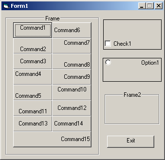



## See how to align Captions on most VB\-Controls\. Align to the top, bottom, left, right etc\.\.\.

### Description

Through the use of API, it can be done, command button's caption can be aligned to the top, and a frame's caption can be centered. Later versions of VB give you that option standard, but not the 6.0 So if you ever wanted to know how its done, here-it-is.
 
### More Info
 

             |
---                |---
**Submitted On**   |2006-09-04 23:54:06
**By**             |[Serge\_G](https://github.com/Planet-Source-Code/PSCIndex/blob/master/ByAuthor/serge-g.md)
**Level**          |Intermediate
**User Rating**    |5.0 (20 globes from 4 users)
**Compatibility**  |VB 4\.0 \(32\-bit\), VB 5\.0, VB 6\.0
**Category**       |[Complete Applications](https://github.com/Planet-Source-Code/PSCIndex/blob/master/ByCategory/complete-applications__1-27.md)
**World**          |[Visual Basic](https://github.com/Planet-Source-Code/PSCIndex/blob/master/ByWorld/visual-basic.md)
**Archive File**   |[See\_how\_to201799952006\.zip](https://github.com/Planet-Source-Code/serge-g-see-how-to-align-captions-on-most-vb-controls-align-to-the-top-bottom-left-right-e__1-66469/archive/master.zip)

